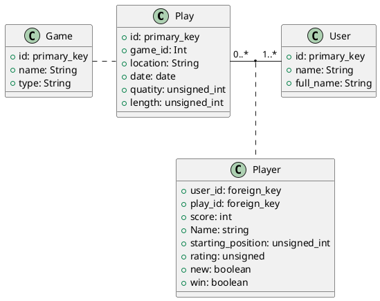

# Board Game Geek
Collect information and calculate statistics

## Input

Currently we can access to data from Board Game Geek via REST API.
It uses the following link to it:
  * https://www.boardgamegeek.com/xmlapi2/

Usage pf Rest API is explained here:
  * https://boardgamegeek.com/wiki/page/BGG_XML_API2

### Data
```xml
<plays username="ristvan" userid="247009" total="2039" page="1" termsofuse="https://boardgamegeek.com/xmlapi/termsofuse">
    <play id="33070661" date="2019-01-05" quantity="1" length="0" incomplete="0" nowinstats="0" location="Otthon">
        <item name="Sanssouci" objecttype="thing" objectid="146816">
            <subtypes>
                <subtype value="boardgame"/>
            </subtypes>
        </item>
        <players>
            <player username="Detti76" userid="237335" name="Detti" startposition="1" color="Red" score="86" new="0" rating="0" win="0"/>
            <player username="ristvan" userid="247009" name="Isti" startposition="2" color="Blue" score="89" new="0" rating="0" win="1"/>
        </players>
    </play>
    <play id="33038839" date="2019-01-04" quantity="1" length="0" incomplete="0" nowinstats="0" location="Dundánál">
        <item name="Gùgōng" objecttype="thing" objectid="250458">
            <subtypes>
                <subtype value="boardgame"/>
            </subtypes>
        </item>
        <players>
            <player username="Dunda" userid="124020" name="Dunda" startposition="1" color="Orange" score="28" new="0" rating="0" win="0"/>
            <player username="Detti76" userid="237335" name="Detti" startposition="2" color="Pink" score="35" new="0" rating="0" win="0"/>
            <player username="ristvan" userid="247009" name="Isti" startposition="3" color="Red" score="48" new="0" rating="0" win="1"/>
            <player username="PZS69" userid="442494" name="PZs" startposition="4" color="Blue" score="32" new="0" rating="0" win="0"/>
        </players>
    </play>
</plays>  
```

## Software
The input data needs to be converted into inner class hiereachy

